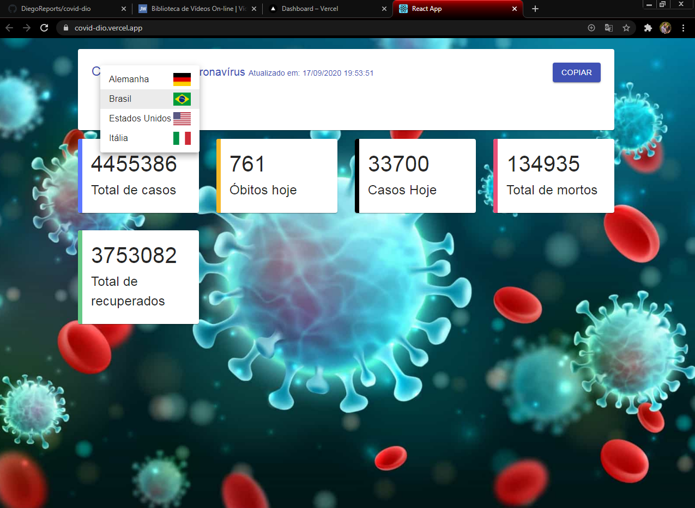

## PREVIEW:
---

Esse projeto foi inicializado com [Create React App](https://github.com/facebook/create-react-app).

## Executando o projeto

Faça um clone do projeto para sua máquina. Para isso você precisa ter o [Git](https://git-scm.com/)

Abra o <strong>GIT CMD</strong> e digite o comando:

### `git clone https://github.com/DiegoReports/covid-dio.git`

Acesse o diretório em seguinda:

### `cd covid-dio`

No diretório do projeto, você pode executar:

### `npm start`

Executa o aplicativo no modo de desenvolvimento.  

Abra [http://localhost:3000](http://localhost:3000) para visualizá-lo no navegador.

## Deploy da Aplicação:

Acesse: [https://covid-dio.vercel.app/](https://covid-dio.vercel.app/)
